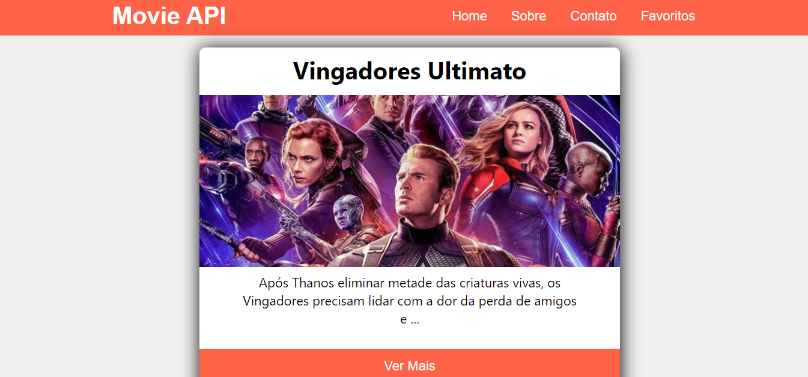
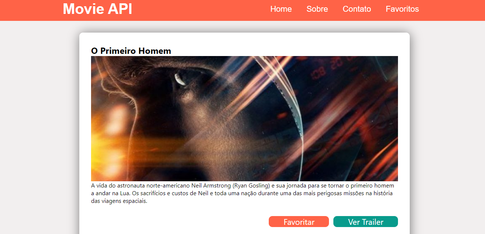
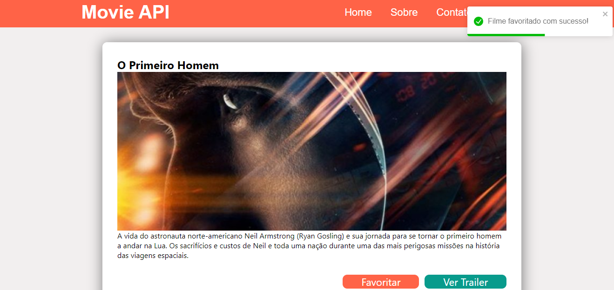
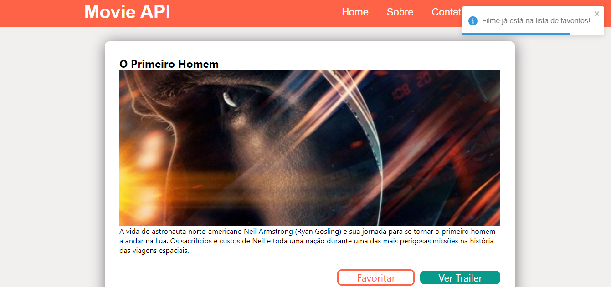
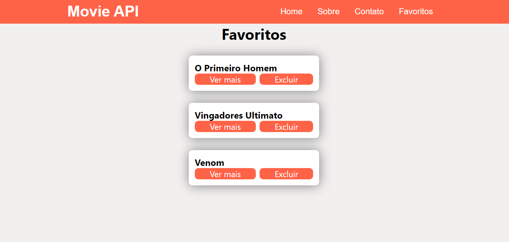

# Projeto de Estudo React

Desenvolvido do zero, baseado no projeto apresentado no curso Matheus Fraga

Recursos:

- Consumo de API de filmes
- Listar Filmes
- Ver Trailer no Youtube
- Ver Detalhes de um Filme
- Listar favoritos (armazenamento usando localStorage)
- Adicionar à lista de favoritos
- Remover da lista de Favoritos
- Toast para notificação de filmes adicionados a lista de favoritos, excluídos e já existentes na lista (usando react-toastify)
- Rotas com react-router-dom
- estilização com css puro e styled-components 💅
- Loading simples enquanto é realizado o fetch da API
- Deploy com integração continua realizado no netlify: https://stmoviereactapp.netlify.app/
- Página Sobre e Contato não implementada (apenas rotas)

## Screenshots

